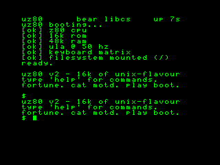
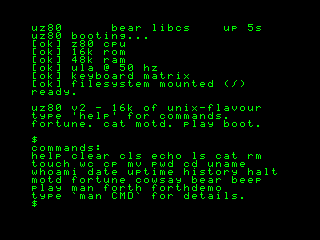
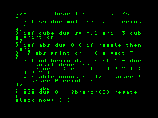
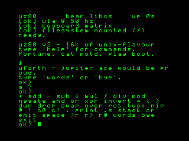
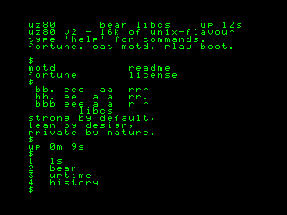
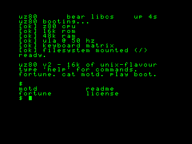
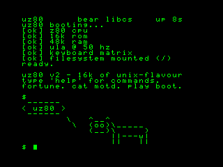
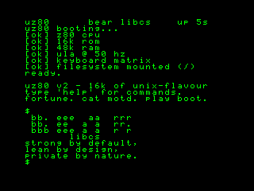
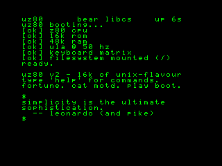
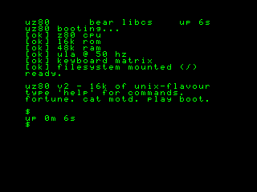

# uZ80

[](https://github.com/FermiHart/uZ80/actions/workflows/ci.yml)

**A freestanding 16 KiB Z80 monitor ROM with a UNIX-flavoured shell and a
small Forth.**

This is a lab diary. It is written in the order things actually happened,
including the parts where I was wrong. If you want the short version: I have a
ZX Spectrum boot ROM, written in C, that runs an interactive shell on a Z80 —
and the emulator it boots in is itself linked against a libc I wrote by hand,
with not one byte of glibc. None of that was the plan.

```
                  UZ80
           Z80 MICRO-KERNEL
       FREESTANDING · NO LIBC

        F E R M I  ∞  H A R T

    uz80 $ _
```

---

## Day 0 — "I just want to compile an old emulator"

I had a 17-year-old tree on disk: `qemu-z80`, Stuart Brady's 2009 branch of
QEMU 0.10.x that teaches it a Zilog Z80 target (it can pretend to be a ZX
Spectrum 48K/128K, a SAM Coupé, an MSX). I typed `make`. Apple clang said no:

```
error: register 'r14' unsuitable for global register variables on this target
```

QEMU 0.10 pins the CPU state pointer to a hardware register —
`register CPUZ80State *env asm("r14")`. GCC has always allowed that. Modern
clang does not. So a 2009 codebase will not build with a 2026 toolchain, and
the blocker is the *compiler*, not me. Annoying. Fine. Detour.

## Day 1 — the detour eats the project

I have this *other* thing: **Bear Libcs**, a C standard library I am writing
from scratch — public-domain, security-first, byte-compatible with the Linux
syscall ABI. Idle thought: instead of fighting clang, what if `qemu-z80` were
linked against **Bear** instead of glibc?

- Bear speaks the *Linux* syscall ABI, so this only makes sense for a Linux
  binary. I build everything from here on inside a **Lima** VM (a real Linux,
  on my Mac). GCC there, not clang — and GCC is fine with the register pinning.
- I measured the gap first. `qemu-system-z80` references **197** libc symbols.
  Bears covers about half by name — but most of the "missing" half already
  exists inside Bear under `bear_*` names, just not exported as POSIX. So the
  real maturity was ~80%.
- I wrote a tiny shim, relinked `qemu-system-z80` static, `-nostdlib`, against
  `libbear.a`. **It linked. Zero undefined symbols. No glibc.**
- Then it *ran*. I logged the Z80: **~22.9 million instructions in 3 seconds**,
  registers advancing, real Z80 disassembly. A full system emulator, hosted on
  my hand-rolled libc.

## Day 2 — evolving the libc, and the bug I'm proudest of finding

A shim that papers over a libc is not interesting. Migrating the gaps *into*
the libc is. So I moved the genuinely-missing surface into Bear's core:
networking aliases, the `scanf` family, `open`/`fcntl`/`writev`/`pread`…, a
chunk of libm, `popen`, a real `pthread_cond_timedwait` backed by a timed
futex. The shim shrank to a single file: a zlib stub (zlib is not libc).

The headline was a real bug. Bear's `sigaction` expected a *kernel*-shaped
`struct sigaction`. Anything compiled with a stock `<signal.h>` — QEMU, bash,
all of it — hands it the *glibc* layout instead. The two disagree on where
`sa_flags` lives. QEMU's `sigfillset` then poisoned exactly the bytes Bear
misread as flags, the kernel rejected the call, and QEMU's `SIGALRM` handler
**silently never installed**. The VM was being killed by its own timer. Fixing
`struct bear_sigaction` to mirror the glibc ABI fixed it for *every* program,
not just QEMU.

(Red herring of the week: `-d cpu` logged only 17 blocks and I was sure it had
livelocked. It hadn't — chained translation blocks just don't re-log. `gdb`
caught it happily executing JIT'd Z80 code. The lesson is always "measure the
thing, not a proxy for the thing.")

End of Day 2: a `qemu-system-z80` that boots a ZX Spectrum, links 100% against
Bear Libcs, and runs the CPU. I fed it the real 48K Spectrum ROM and watched
`© 1982 Sinclair Research Ltd` appear. Goosebumps, honestly.

## Day 3 — UZ80: putting something of *mine* inside it

I had an emulator on my Bear Libcs. I wanted my own code running *on the Z80*. So I
wrote a kernel.

**uZ80** is a bare-metal ZX Spectrum boot ROM, written in C, compiled with
**SDCC** to a 16 KiB image. There is no operating system under it and no libc
beside it — the Z80 resets to `0x0000` and runs *this*:

- `crt0.s` — the reset vector. Sets the stack, zeroes RAM scratch, installs
  `IM 1` so the ULA's 50 Hz frame interrupt vectors through `0x0038`, calls
  `main()`. It also has the keyboard-matrix scan routine.
- `kernel.c` wires boot, status, sound and the shell loop. The font, terminal,
  keyboard decoder, filesystem, command table and Forth VM are separate small
  modules with explicit contracts in `uz80.h`.

What it does when you boot it:

- paints a boot splash and a prompt — `$`
- **reads the keyboard** straight off the Spectrum matrix
- **blinks the cursor** off the 50 Hz hardware interrupt — a real clock, not a
  delay loop
- shows frame-derived uptime sampled between commands; the current 16-bit clock
  wraps after about 21m51s and is scheduled for replacement
- runs ~30 built-in commands: a small UNIX-flavoured shell (`ls`, `cat`, `cp`,
  `mv`, `rm`, `wc`, `echo … > file`) over an in-RAM filesystem, plus `help`,
  `history`, `uptime`, `cowsay`, `fortune`, `bear`, `play`, with backspace
  (CAPS SHIFT + 0, the Spectrum's DELETE) and UP/DOWN command history
- ships **uForth** — a tiny Forth (Jupiter Ace tribute): colon definitions,
  `IF/ELSE/THEN`, `BEGIN/UNTIL`, `VARIABLE`, and a `SEE` decompiler

The SDCC 4.2.0 build currently occupies **14,657 of 16,384 bytes** (89%).
`make check` fails if any emitted byte crosses the ROM boundary.

---


Every interface UZ80 touches is genuine ZX Spectrum hardware: the 16 KiB ROM at `0x0000`, 
the framebuffer at `0x4000`, the `0xFE` border/keyboard port, the `IM 1` interrupt at `0x0038`. 
SDCC emits genuine Z80 machine code. The `uz80.rom` file contains nothing emulator-specific 
— Bear and QEMU are only the workbench.

Burn `uz80.rom` onto a 16 KiB EPROM (a 27C128), drop it in place of a real
Spectrum's ROM, power on: it would boot. Honest caveat — I have verified it in
emulation only, not yet on physical silicon. The interfaces it uses are simple
and standard enough that I expect it to just work.

## Build it

The native build needs SDCC 4.2.0 (`sdcc`, `sdasz80`, `makebin`), GNU Make,
Python 3 and a C compiler for host regressions. Output defaults to `build/`;
set `BUILD=/some/path` for a read-only checkout.

```sh
make            # build and validate build/uz80.rom (exactly 16 KiB)
make test       # host tests under ASan/UBSan + validator regressions
make check      # tests + ROM/RAM gates + two-build reproducibility proof
make run        # build + boot in qemu-system-z80, VNC on :5948
make shot       # build + boot headless + screenshot
make demo       # build + boot + type a command + screenshot
make help
```

`make demo DEMO="h e l p ret"` types a different command at the prompt.
`run`, `shot` and `demo` require the external qemu-z80 fork and keymaps; set
`QEMU=` and `KEYMAPS=` to their paths. VNC is explicitly loopback-bound.

For a repository-defined SDCC 4.2.0 environment instead of host packages:

```sh
docker build -t uz80-toolchain:sdcc-4.2 .
mkdir -p .container-work
docker run --rm --user "$(id -u):$(id -g)" \
  -v "$PWD:/src:ro" -v "$PWD/.container-work:/work" \
  uz80-toolchain:sdcc-4.2 \
  make -C /src BUILD=/work/build check
```

## What `make check` proves

- Intel HEX records have valid lengths and checksums.
- Every emitted byte is below `0x4000` and exactly matches the final ROM.
- `_DATA` starts at `0x6010`, ends before the filesystem at `0x6400`, and no
  unsupported `_INITIALIZER` data is silently lost by the custom CRT.
- Host shell/filesystem, keyboard-shift and editor-boundary regressions pass
  with AddressSanitizer and UndefinedBehaviorSanitizer.
- Two clean builds produce byte-identical ROMs.

This is still emulator-tested, not physical-hardware-proven. The Docker base
image and direct SDCC package are fixed, but Ubuntu's apt dependency indexes are
not snapshot-pinned, so the environment is not yet hermetic across time. The
custom qemu-z80 fork is also not pinned or exercised in CI, and uForth's
malformed program/error paths need a dedicated hardening wave. See
[ROADMAP.md](ROADMAP.md).

## Layout

```
crt0.s     reset vector · 50 Hz IM 1 ISR · keyboard scan   (Z80 asm)
kernel.c   boot splash · status bar · beeper · main loop   (C, SDCC)
keyboard.c Spectrum matrix · CAPS/SYMBOL layers
editor.c   pure line-capacity contract
tty.c      thirds-interleaved framebuffer · line editor · history
font.c     hand-drawn 5×7 bitmap font, ASCII 32..127
fs.c       in-RAM filesystem (16 slots, 255-byte text payloads)
cmd.c      the shell — ~30 built-in commands + dispatch table
forth.c    uForth — tokeniser, compiler, threaded inner interpreter
uz80.h     shared types, the memory map, and subsystem contracts
tools/     fail-closed map/IHX/ROM validator
tests/     host regressions and build-system contracts
Makefile   build, proof, reproducibility and emulator automation
Dockerfile versioned SDCC build environment
```

## Gallery

Every shot below records a real boot in `qemu-system-z80`. The gallery predates
the proof pipeline and does not yet carry per-image command or commit metadata.

| | |
|---|---|
|  |  |
| *boot splash, status bar, and `/motd`* | *`help` — the full command set* |
|  |  |
| *`forthdemo` — IF/THEN, BEGIN/UNTIL, VARIABLE, SEE* | *the live `forth` REPL: `10 20 add .` → 30, `words`* |
|  |  |
| *`history` — real numbered recall* | *`ls` over the in-RAM filesystem* |
|  |  |
| *`cowsay uz80`* | *`bear` — Bear Libcs tribute banner* |
|  |  |
| *`fortune` — LFSR-picked quote* | *`uptime` off the 50 Hz ISR* |

## Credits & license

- `qemu-z80` — QEMU by Fabrice Bellard; the Z80 target by Stuart Brady (2009).
  My change to it was four lines in `configure` (a macOS linker case).
- **Bear Libcs** — my own libc; the QEMU port and the bug fixes live in its
  `ports/qemu/` tree.
- UZ80 itself: public domain. Unlicense. Take it, burn it, break it.
- Listening recommended: [open.spotify.com/playlist/6flrLsdYxQZvGNRkdohL7o](https://open.spotify.com/playlist/6flrLsdYxQZvGNRkdohL7o)

— F E R M I ∞ H A R T
